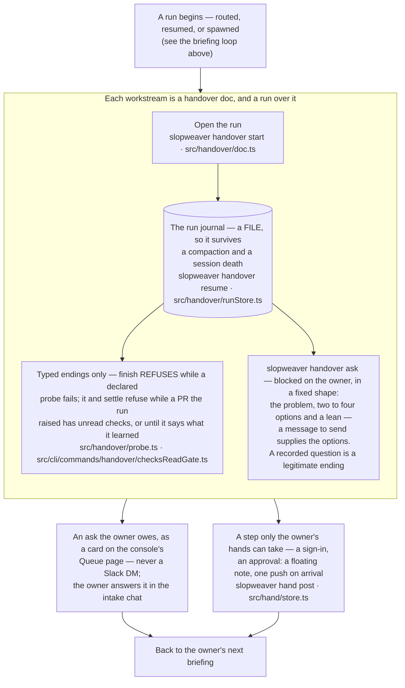

# 5 · The run lifecycle

Part of [Architecture](../architecture.md).

However it started, a run is a handover doc — opened, journaled, and swept back to the owner:

```mermaid
flowchart TB
  run["A run begins — routed, resumed, or spawned<br/>(see the briefing loop above)"]

  subgraph lifecycle["Each workstream is a handover doc, and a run over it"]
    direction TB
    start["Open the run<br/>slopweaver handover start · src/handover/doc.ts"]
    jr[("The run journal — a FILE, so it survives<br/>a compaction and a session death<br/>slopweaver handover resume · src/handover/runStore.ts")]
    probe["Typed endings only — finish REFUSES while a declared<br/>probe fails; it and settle refuse while a PR the run<br/>raised has unread checks, or until it says what it learned<br/>src/handover/probe.ts · src/cli/commands/handover/checksReadGate.ts"]
    ask["slopweaver handover ask — blocked on the owner, in a fixed shape:<br/>the problem, two to four options and a lean —<br/>a message to send supplies the options.<br/>A recorded question is a legitimate ending"]

    start --> jr
    jr --> probe
    jr --> ask
  end

  queue["An ask the owner owes, as a card on the console's<br/>Queue page — never a Slack DM;<br/>the owner answers it in the intake chat"]
  hand["A step only the owner's hands can take — a sign-in,<br/>an approval: a floating note, one push on arrival<br/>slopweaver hand post · src/hand/store.ts"]
  owner["Back to the owner's next briefing"]

  run --> lifecycle
  lifecycle --> queue --> owner
  lifecycle --> hand --> owner
```
